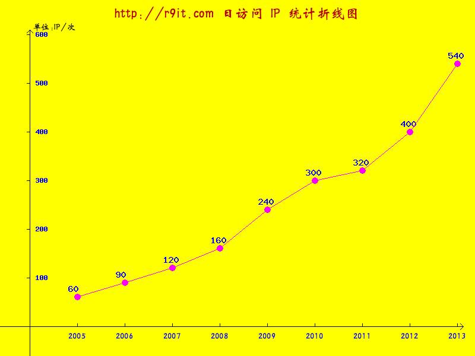
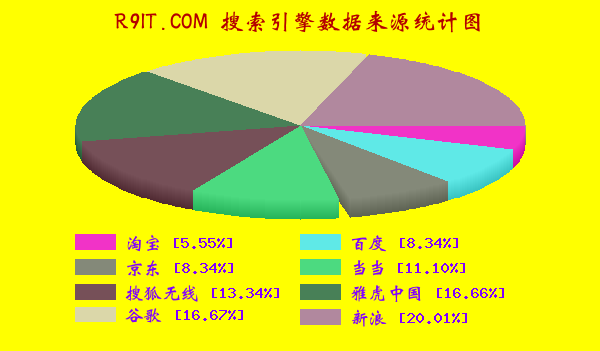
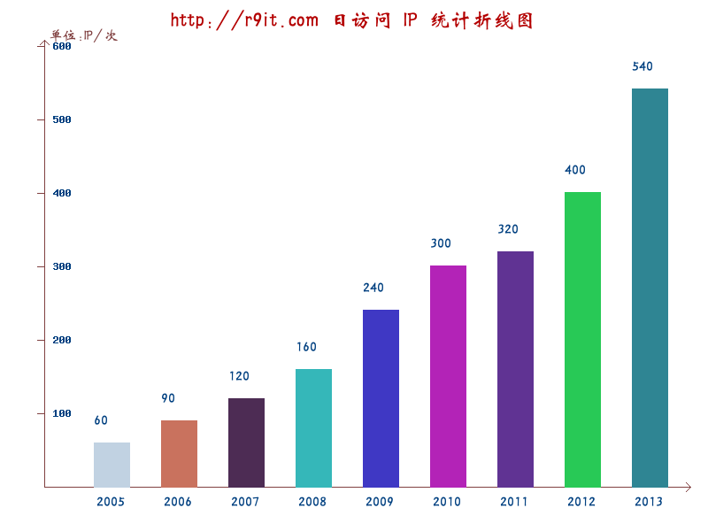
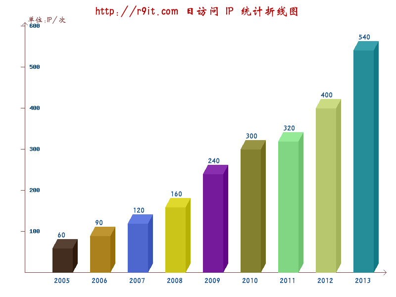
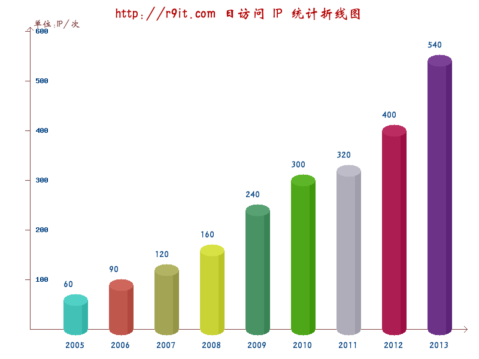

# php-chart
一个 PHP 图表生成工具，开箱即用，生成各种折线图，2D/3D 饼状图，条形图等。

## 如何使用
```bash
composer install rockyangs/php-chart
```

## Sample code
```php
require_once("./vendor/autoload.php");

$data = array(
    '2005'  => '60',
    '2006' 	=> '90',
    '2007'  => '120',
    '2008'  => '160',
    '2009'  => '240',
    '2010'  => '300',
    '2011'  => '320',
    '2012'  => '400',
    '2013'	=> '540'
);
//Y坐标抽参数 步长 => 点数
$axisy = array(100, 6);			
$config = array(
    'data' 	=> $data,
    'axisy' => $axisy,
    'title' => 'Sample Broken Line Chart',
    'unit' => 'IP/次',
    't_fsize' => 18,
    't_font' => 0,
    'bg_size' => array(800, 600)
);

$chart = ChartFactory::create(BrokenChart::class, $config);
// show image in browser
$chart->showChart();
// save image to file
$chart->saveChart("{$dir}/broken-chart.png", 'png');
```

## 效果预览

### 折线图


### 饼状图


### 条形图




